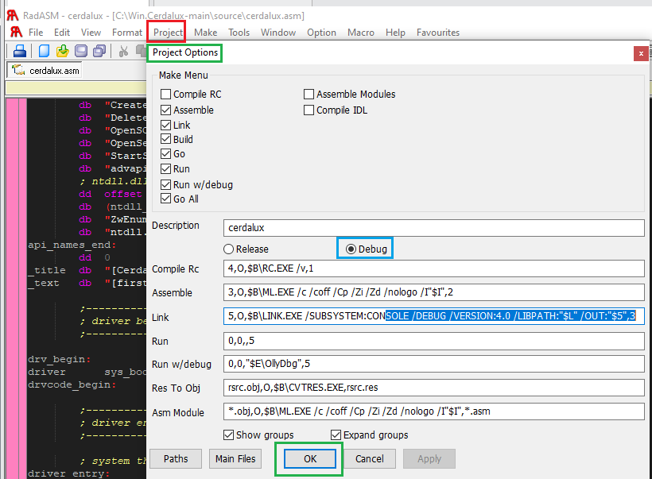

  
  <h1>Win.Cerdalux</h1>
   
  
<i>WinXPSP2.Cermalus on stereoids, supporting all 32 bits Windows version. Windows Kernel Virus stuff for noobs</i>

  
<i>based from WinXPSP2.Cermalus by Pluf/7A69ML https://github.com/therealdreg/WinXPSP2.Cermalus/</i>

Are you an usermode malware reverser/researcher/developer wanting to get started with the windows kernel? Then this project is for you

# FAQ

## What is Win.Cerdalux?

...

## How it works?

...

##  What are the supported Windows versions?

...

# developer steps

- Clone this repo in C:\
- Download & install in C:\ **Masm32v11r** [/stuff/masm32v11r.zip](/stuff/masm32v11r.zip)
- Download & install in C:\ **RadASM-2.2.2.4-FullPackage.zip** [/stuff/RadASM-2.2.2.4-FullPackage.zip](/stuff/RadASM-2.2.2.4-FullPackage.zip)
- Add **C:\masm32\bin** to **%PATH%**
- Open **/source/cerdalux.rap** in Radasm2 IDE and Build All
- Done!

## debug build

# To-Do

## General

- [ ] dropper with .ico (new logo)
- [ ] CI/CD implementation for testing
- [ ] Write documentation
- [ ] FAQ
- [x] port to Masm32v11r
- [x] create Radasm project
- [x] basic CI for wine https://github.com/therealdreg/dregs-masm32-wine

## Features

- [ ] Multi-core support: KeSetTargetProcessorDpc + KeInsertQueueDpc...
- [ ] Support newer Windows versions
    - [x] Windows XP SP2
    - [x] Windows XP SP3
- [ ] 64-bit support

# Credits

- Pluf/7A69ML original author WinXPSP2.Cermalus
- David Reguera Garcia aka Dreg

# Thx

- masm32 forum https://www.masm32.com/board/index.php
- https://www.masm32.com/
- RadASM2 repo by @mrfearless https://github.com/mrfearless/RadASM2
- 29a ezine https://www.exploit-db.com/ezines/kr5hou2zh4qtebqk.onion/29A/

# Variants

- https://github.com/therealdreg/WinXPSP2.Cermalus
